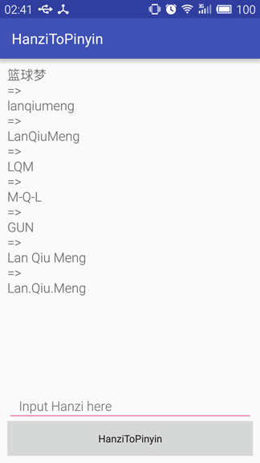

## HanziToPinyin

#### 输出格式选项的组合

在pinyin4j中定义了三种类型的输出格式选项：

- VCharType: 拼音字符 '&#252;' 的文本输出格式，有三种选项：

|选项|描述|
|----|----|
|WITH_U_AND_COLON|使用 **u:** 的方式来表示，默认方式|
|WITH_V|使用 **v** 的方式来表示|
|WITH_U_UNICODE|使用 **&#252;** 的方式来表示|

- ToneType: 中文拼音声调的输出格式，有三种选项：

|选项|描述|
|----|----|
|WITH_TONE_NUMBER|使用数字标识拼音声调 (m&#462;) 的方式，默认方式|
|WITHOUT_TONE|不使用拼音声调 (ma)|
|WITH_TONE_MARK|使用调号来标识拼音声调 (ma3) 的方式|


- CaseType: 输出字符串中的字母的操作，有两种选项：

|选项|描述|
|----|----|
|LOWERCASE|将字母全部转成小写，默认方式|
|UPPERCASE|将字母全部转成大写|

这里三种输出格式的一些组合是被禁用的。例如，'吕'：

|LOWERCASE||||
|----|----|----|----|
|Combination|WITH_U_AND_COLON|WITH_V|WITH_U_UNICODE|
|WITH_TONE_NUMBER|lu:3|lv3|l&#252;3|
|WITHOUT_TONE|lu:|lv|l&#252;|
|WITH_TONE_MARK|Exception|Exception|l&#474;|

|UPPERCASE||||
|----|----|----|----|
|Combination|WITH_U_AND_COLON|WITH_V|WITH_U_UNICODE|
|WITH_TONE_NUMBER|LU:3|LV3|L&#220;3|
|WITHOUT_TONE|LU:|LV|L&#220;|
|WITH_TONE_MARK|Exception|Exception|L&#473;|

#### Numerals in place of tone marks (声调号的数字表示)

|Tone|Tone Mark|Number added to end of syllable <br/>in place of tone mark|Example using <br/>tone mark|Example using <br/>number|
|----|----|----|----|----|
|First|macron (&#175;)|1|m&#257;|ma1|
|Second|acute accent (&#180;)|2|m&#225;|ma2|
|Third|caron (&#711;)|3|m&#462;|ma3|
|Fourth|grave accent (&#96;)|4|m&#224;|ma4|

## Links:

**[Combination of output format options](http://pinyin4j.sourceforge.net/html/combination.html)**

**[Unicode&reg; character table](http://unicode-table.com/en/#control-character)**

**[Pinyin](https://en.wikipedia.org/wiki/Pinyin)**

**[pinyin4j](http://pinyin4j.sourceforge.net/)**

----

#### pinyin4j库的使用

- activity_main.xml

```xml
<?xml version="1.0" encoding="utf-8"?>
<LinearLayout
    xmlns:android="http://schemas.android.com/apk/res/android"
    xmlns:tools="http://schemas.android.com/tools"
    android:orientation="vertical"
    android:layout_width="match_parent"
    android:layout_height="match_parent"
    android:layout_margin="10dp"
    tools:context="com.shellever.hanzitopinyin.MainActivity">

    <TextView
        android:layout_width="match_parent"
        android:layout_height="0dp"
        android:layout_weight="1"
        android:text="No Information"
        android:textAllCaps="false"
        android:textSize="18sp"
        android:id="@+id/tv_pinyin" />

    <EditText
        android:layout_width="match_parent"
        android:layout_height="wrap_content"
        android:hint="Input Hanzi here"
        android:id="@+id/et_hanzi" />

    <Button
        android:layout_width="match_parent"
        android:layout_height="wrap_content"
        android:text="HanziToPinyin"
        android:textAllCaps="false"
        android:id="@+id/btn_convert" />
</LinearLayout>
```

* MainActivity.java

```java
public class MainActivity extends AppCompatActivity {

    private TextView tv_pinyin;
    private EditText et_hanzi;
    private Button btn_convert;

    @Override
    protected void onCreate(Bundle savedInstanceState) {
        super.onCreate(savedInstanceState);
        setContentView(R.layout.activity_main);

        tv_pinyin = (TextView) findViewById(R.id.tv_pinyin);
        et_hanzi = (EditText) findViewById(R.id.et_hanzi);
        btn_convert = (Button) findViewById(R.id.btn_convert);

        btn_convert.setOnClickListener(new View.OnClickListener() {
            @Override
            public void onClick(View v) {
                String hanzi = et_hanzi.getText().toString();
                if (TextUtils.isEmpty(hanzi)) {
                    Toast.makeText(MainActivity.this, "No hanzi, please input again.", Toast.LENGTH_SHORT).show();
                } else {
                    StringBuilder builder = new StringBuilder();
                    builder.append(hanzi);
                    builder.append("\n=>\n");
                    // 拼音字母全部小写，没有分隔符
                    builder.append(PinyinUtils.toPinyinString(hanzi));
                    builder.append("\n=>\n");
                    // 拼音首字母大写
                    builder.append(PinyinUtils.toPinyinString(hanzi, PinyinUtils.CASE_CAPITALIZE));
                    builder.append("\n=>\n");
                    // 拼音取首字母且大写，从左到右
                    builder.append(PinyinUtils.toPinyinString(hanzi,
                            PinyinUtils.CASE_UPPERCASE | PinyinUtils.LETTER_FIRST));
                    builder.append("\n=>\n");
                    // 拼音取首字母且大写，从右到左，连字符分隔
                    builder.append(PinyinUtils.toPinyinString(hanzi,
                            PinyinUtils.CASE_UPPERCASE
                                    | PinyinUtils.LETTER_FIRST_INV
                                    | PinyinUtils.SEPARATOR_HYPHEN));
                    builder.append("\n=>\n");
                    // 拼音取尾字母且大写，从右到左
                    builder.append(PinyinUtils.toPinyinString(hanzi,
                            PinyinUtils.CASE_UPPERCASE | PinyinUtils.LETTER_LAST_INV));
                    builder.append("\n=>\n");
                    // 拼音首字母大写且空格分开
                    builder.append(PinyinUtils.toPinyinString(hanzi,
                            PinyinUtils.CASE_CAPITALIZE | PinyinUtils.SEPARATOR_BLANK));
                    builder.append("\n=>\n");
                    // 拼音首字母大写且英文句号分开
                    builder.append(PinyinUtils.toPinyinString(hanzi,
                            PinyinUtils.CASE_CAPITALIZE | PinyinUtils.SEPARATOR_POINT));
                    tv_pinyin.setText(builder.toString());
                    et_hanzi.setText("");
                }
            }
        });
    }

    @Override
    public boolean onTouchEvent(MotionEvent event) {
        // 点击空白区域 自动隐藏软键盘
        if(this.getCurrentFocus() != null){
            InputMethodManager mInputMethodManager = (InputMethodManager) getSystemService(INPUT_METHOD_SERVICE);
            return mInputMethodManager.hideSoftInputFromWindow(this.getCurrentFocus().getWindowToken(), 0);
        }
        return super.onTouchEvent(event);
    }
}
```

* PinyinUtils.java

PinyinUtils类中提供了五组可以配置的操作模式用于返回特定格式的字符串，不同组之间的选项可以使用逻辑运算或运算 `|` 进行组合以达到想要的格式。
**注：** 组内选项之间是有优先级的，数值越小优先级越高，当使用了一组内的多个选项，只有优先级高的选项才会生效。

配置使用例子：

```java
// 和道一文字 => hedaoyiwenzi        // NONE
// 和道一文字 => HDYWZ               // CASE_UPPERCASE | LETTER_FIRST     or CASE_CAPITALIZE | LETTER_FIRST
// 和道一文字 => ZWYDH               // CASE_UPPERCASE | LETTER_FIRST_INV or CASE_CAPITALIZE | LETTER_FIRST_INV
// 和道一文字 => HeDaoYiWenZi        // CASE_CAPITALIZE
// 和道一文字 => He Dao Yi Wen Zi    // CASE_CAPITALIZE | SEPARATOR_BLANK
```

PinyinUtils源码如下：

```java
/**
 * Author: Shellever
 * Date:   11/7/2016
 * Email:  shellever@163.com
 */
public class PinyinUtils {

    // 组 0
    public static final int NONE = 0x0000;                // 全部小写字母，没有分隔符
    // 组 1
    public static final int CASE_CAPITALIZE = 0x0001;     // 拼音首字母大写
    public static final int CASE_UPPERCASE = 0x0002;      // 全部大写字母
    // 组 2
    public static final int LETTER_FIRST = 0x0004;        // 获取拼音首字母，方向为从左到右
    public static final int LETTER_FIRST_INV = 0x0008;    // 获取拼音首字母，方向为从右到左
    public static final int LETTER_LAST = 0x0010;         // 获取拼音尾字母，方向为从左到右
    public static final int LETTER_LAST_INV = 0x0020;     // 获取拼音尾字母，方向为从右到左
    // 组 3
    public static final int TRIM_NON_CHAR = 0x0040;       // 去掉非字符
    // 组 4 (可以根据规则进行扩展)
    public static final int SEPARATOR_BLANK = 0x0080;     // 分隔符：空格
    public static final int SEPARATOR_POINT = 0x0100;     // 分隔符：英文句号
    public static final int SEPARATOR_HYPHEN = 0x0200;    // 分隔符：连字符


    // 默认：全部小写字母，没有分隔符
    public static String toPinyinString(String hanzi) {
        return toPinyinString(hanzi, NONE);
    }

    public static String toPinyinString(String hanzi, int mode) {
        StringBuilder builder = new StringBuilder();
        if (hanzi != null) {
            int length = hanzi.length();                // 长度
            String tmp;
            for (int i = 0; i < length; i++) {
                char hanziChar = hanzi.charAt(i);       // 获取指定索引号的字符
                if (checkHanziChar(hanziChar)) {
                    tmp = toPinyinChar(hanziChar);      // 全部小写
                    if ((mode & CASE_CAPITALIZE) != NONE) {
                        tmp = capitalize(tmp);          // 首字母大写 (高优先级)
                    } else if ((mode & CASE_UPPERCASE) != NONE) {
                        tmp = tmp.toUpperCase();        // 全部大写
                    }

                    if ((mode & LETTER_FIRST) != NONE || (mode & LETTER_FIRST_INV) != NONE) {
                        tmp = tmp.substring(0, 1);              // 拼音首字母 (高优先级)
                    } else if ((mode & LETTER_LAST) != NONE || (mode & LETTER_LAST_INV) != NONE) {
                        tmp = tmp.substring(tmp.length() - 1);  // 拼音尾字母
                    }
                } else {
                    tmp = Character.toString(hanziChar);
                    if ((mode & TRIM_NON_CHAR) != NONE) {
                        tmp = "";           // 去掉非字符
                    }
                }

                String separator = "";      // 默认不加分隔符
                if ((mode & SEPARATOR_BLANK) != NONE) {
                    separator = " ";        // 加入空格分隔符 (高优先级)
                } else if ((mode & SEPARATOR_POINT) != NONE) {
                    separator = ".";        // 加入英文句号分隔符
                } else if ((mode & SEPARATOR_HYPHEN) != NONE) {
                    separator = "-";        // 加入连字符分隔符
                }

                if (i >= length - 1) {      // 跳过最后一个汉字拼音的分隔符
                    separator = "";
                }

                // add the string to builder now
                if ((mode & LETTER_FIRST_INV) != NONE || (mode & LETTER_LAST_INV) != NONE) { // RTL
                    builder.insert(0, tmp);         // 1. 将tmp插入到头部，实现从右到左的方向
                    builder.insert(0, separator);   // 2. 将分隔符插入到头部
                } else {    // LTR - LeftToRight
                    builder.append(tmp);            // 1. 将tmp追加到尾部，实现从左到右的方向
                    builder.append(separator);      // 2. 将分隔符追加到尾部
                }
            }   // for (int i = 0; i < length; i++)
        }   // if (hanzi != null)
        return builder.toString();
    }

    public static String toPinyinChar(char hanziChar) {
        HanyuPinyinOutputFormat format = new HanyuPinyinOutputFormat();
        format.setCaseType(HanyuPinyinCaseType.LOWERCASE);      // 全部小写
        format.setToneType(HanyuPinyinToneType.WITHOUT_TONE);   // 没有声调
        format.setVCharType(HanyuPinyinVCharType.WITH_V);       // 使用v
        return toPinyinChar(hanziChar, format);
    }

    public static String toPinyinChar(char hanziChar, HanyuPinyinOutputFormat format) {
        String[] result = null;
        try {
            // 非汉字字符放回null
            result = PinyinHelper.toHanyuPinyinStringArray(hanziChar, format);
        } catch (BadHanyuPinyinOutputFormatCombination e) {
            e.printStackTrace();
        }
        return result != null ? result[0] : "";
    }

    // 检查输入字符是否匹配到unicode中的汉字区间内
    public static boolean checkHanziChar(char hanziChar) {
        return Character.toString(hanziChar).matches("[\\u4E00-\\u9FA5]+");
    }

    public static String capitalize(String s) {
        return s.substring(0, 1).toUpperCase() + s.substring(1);
    }
}
```

* 效果演示

